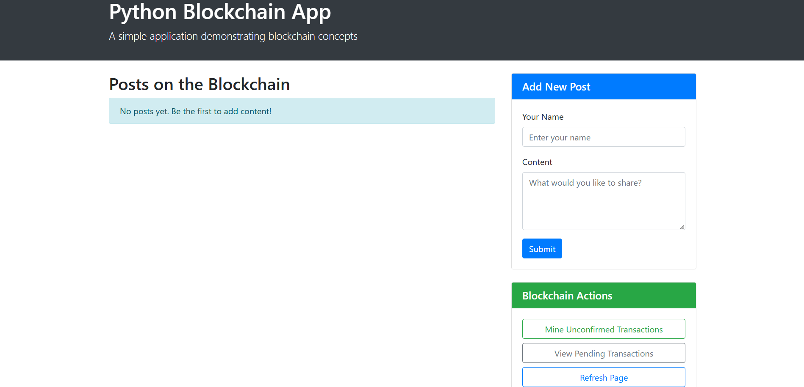
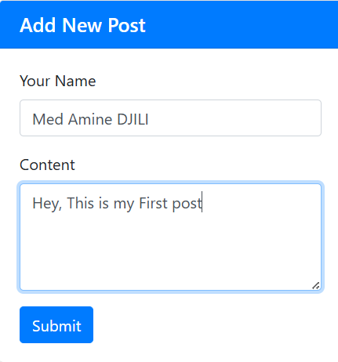
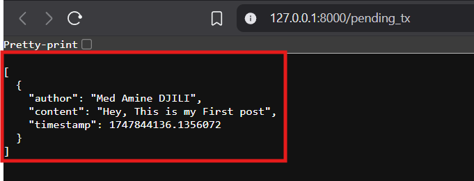
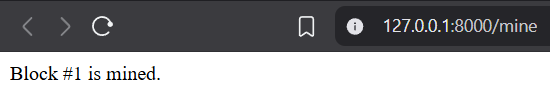
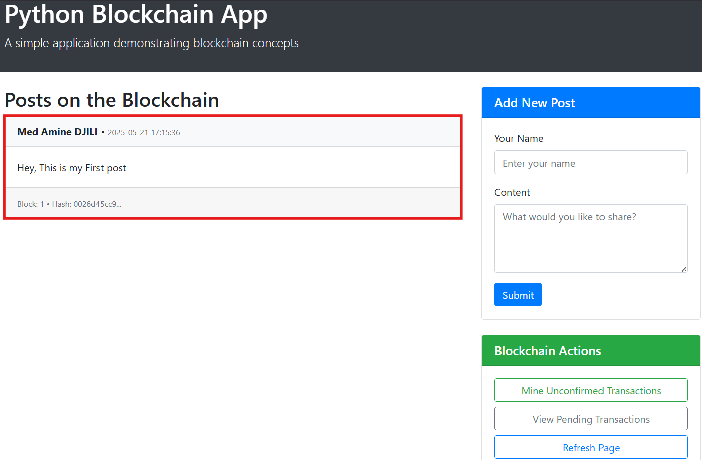

[![Unlicense License][license-shield]][license-url]
[![LinkedIn][linkedin-shield]][linkedin-url]
# **Python Blockchain Application**

A hands-on blockchain application built with Python and Flask that I developed to enhance my understanding of blockchain technology.  
This project demonstrates the core concepts of blockchain such as transactions, mining, proof-of-work, and decentralized consensus.  
It also includes a simple web frontend and the ability to simulate a peer-to-peer network with multiple nodes.

---
# **Built With**

This project was built using the following major technologies:

* [![Python][Python.org]][Python-url]
* [![HTML5][HTML5.org]][HTML5-url]
* [![CSS3][CSS3.org]][CSS3-url]
* [![Git][Git-scm.com]][Git-url]
* [![Bootstrap][Bootstrap.com]][Bootstrap-url]

---

## **Project Structure**

```
python_blockchain_app/
├── blockchain/         # Core blockchain logic (Block, Blockchain)
├── node/               # Node server exposing the blockchain API
├── app/                # Frontend interface built with Flask + HTML
├── run_app.py          # Script to run the frontend app
├── run_node.py         # Script to launch blockchain node with custom port
├── requirements.txt    # Project dependencies
```

---

## **Features**

- Submit and store transactions in blocks
    
- Mine new blocks using proof-of-work
    
- Maintain a valid blockchain across peers
    
- Decentralized consensus mechanism
    
- Sync between multiple nodes
    
- Web interface for posting and mining
    

---

## **Installation**

1. Clone the repository:
    

```
git clone https://github.com/yourusername/python_blockchain_app.git
cd python_blockchain_app
```

2. Create and activate a virtual environment (optional but recommended):
    

```
python -m venv venv
# On macOS/Linux:
source venv/bin/activate
# On Windows:
venv\Scripts\activate
```

3. Install required packages:
    

```
pip install -r requirements.txt
```

---

## **Running the Application**

### Start a Blockchain Node

```
python run_node.py --port 8000
```

This launches a blockchain node at http://127.0.0.1:8000.

### Start the Web Frontend

In another terminal:

```
python run_app.py
```

The web app will be available at http://127.0.0.1:5000

---

## **Running Multiple Nodes**

You can simulate a peer-to-peer blockchain network:

### 1. Start Multiple Nodes

```
python run_node.py --port 8001
python run_node.py --port 8002
```

### 2. Register the New Nodes

Use `curl` to connect them to the main node:

```
curl -X POST http://127.0.0.1:8001/register_with \
     -H 'Content-Type: application/json' \
     -d '{"node_address": "http://127.0.0.1:8000"}'

curl -X POST http://127.0.0.1:8002/register_with \
     -H 'Content-Type: application/json' \
     -d '{"node_address": "http://127.0.0.1:8000"}'
```

This registers nodes 8001 and 8002 with node 8000 and syncs their chains.

### 3. View Blockchain on Each Node

```
curl http://127.0.0.1:8000/chain
curl http://127.0.0.1:8001/chain
curl http://127.0.0.1:8002/chain
```

---
### Homepage Interface



### Adding a Post






### After Mining



---

## **License**

This project is open source and available under the MIT License.

[Python.org]: https://img.shields.io/badge/Python-3776AB?style=for-the-badge&logo=python&logoColor=white
[Python-url]: https://www.python.org/
[HTML5.org]: https://img.shields.io/badge/HTML5-E34F26?style=for-the-badge&logo=html5&logoColor=white
[HTML5-url]: https://developer.mozilla.org/en-US/docs/Web/Guide/HTML/HTML5
[CSS3.org]: https://img.shields.io/badge/CSS3-1572B6?style=for-the-badge&logo=css3&logoColor=white
[CSS3-url]: https://developer.mozilla.org/en-US/docs/Web/CSS
[Git-scm.com]: https://img.shields.io/badge/Git-F05032?style=for-the-badge&logo=git&logoColor=white
[Git-url]: https://git-scm.com/
[Bootstrap.com]: https://img.shields.io/badge/Bootstrap-563D7C?style=for-the-badge&logo=bootstrap&logoColor=white
[Bootstrap-url]: https://getbootstrap.com/
[license-shield]: https://img.shields.io/github/license/othneildrew/Best-README-Template.svg?style=for-the-badge
[license-url]: https://github.com/SieGer05/BlockPost/blob/main/LICENSE
[linkedin-shield]: https://img.shields.io/badge/-LinkedIn-black.svg?style=for-the-badge&logo=linkedin&colorB=555
[linkedin-url]: https://www.linkedin.com/in/djili-mohamed-amine-5017b01a0/